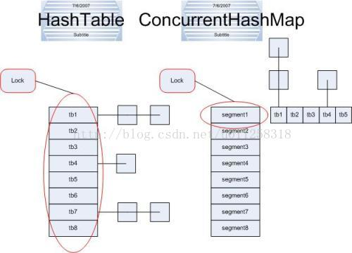

# Basic BeanFactory（上）   

M：spring构造开始，首先要创建什么文件呢？

Z：我们采用的是maven项目，pom文件里面一开始只需要有junit，和解析xml的dom4j就可以了

```xml
<project xmlns="http://maven.apache.org/POM/4.0.0" xmlns:xsi="http://www.w3.org/2001/XMLSchema-instance" xsi:schemaLocation="http://maven.apache.org/POM/4.0.0 http://maven.apache.org/xsd/maven-4.0.0.xsd">
  <modelVersion>4.0.0</modelVersion>
  <groupId>cn.leekoko</groupId>
  <artifactId>litespring</artifactId>
  <version>0.0.1-SNAPSHOT</version>
  
  <dependencies>
	<!-- 单元测试 -->
	<dependency>
		<groupId>junit</groupId>
		<artifactId>junit</artifactId>
		<version>4.12</version>
		<scope>test</scope>
	</dependency>
    <dependency>
		<groupId>dom4j</groupId>
		<artifactId>dom4j</artifactId>
		<version>1.6.1</version>
	</dependency>  
  </dependencies>
  
</project>
```

D：现在通过TDD要实现一个功能：从xml配置文件中获取Bean的定义&Bean的实例

Z：简单来说就是Spring具有以下功能：用户只需配置好xml文件，就能通过Spring容器将Bean对象获取出来，而我们这里就是要实现这种搬运的效果。

M：那要做从xml配置文件中获取指定Bean对象，首先需要有xml文件吧？

Z：xml文件内容如下，由于是测试的xml文件，放在test/resources目录下

petstore-v1.xml

```xml
<?xml version="1.0" encoding="UTF-8"?>
<beans xmlns="http://www.springframework.org/schema/beans"
	xmlns:xsi="http://www.w3.org/2001/XMLSchema-instance" 
	xsi:schemaLocation="http://www.springframework.org/schema/beans 
		http://www.springframework.org/schema/beans/spring-beans.xsd">
	
	<bean id="petStore" 
	class="org.litespring.service.v1.PetStoreService">
	</bean>

</beans>
```

D：有了素材之后，第一步是编写预想中的测试案例

M：要怎么测试一个 通过xml中实例化一个类出来的方法呢？

Z：如下代码

```java
	@Test
	public void testGetBean() {
		//读取配置文件
		BeanFactory factory = new DefaultBeanFactory("petstore-v1.xml");
		BeanDefinition bd = factory.getBeanDefinition("petStore");
		//校验配置文件属性
		assertEquals("org.litespring.service.v1.PetStoreService", bd.getBeanClassName());
		//实例化对象
		PetStoreService petStore = (PetStoreService)factory.getBean("petStore");
		//判断对象成功实例化否
		assertNotNull(petStore);
	}
```

M：为什么用不存在的``BeanFactory``来获取``petstore-v1.xml``配置文件呢？

Z：这是一种构造读取配置文件的思路，首先读取，然后实例化。只不过读取分成了两步，先获取配置文件，再获取bean对象

```java
		//读取配置文件
		BeanFactory factory = new DefaultBeanFactory("petstore-v1.xml");
		BeanDefinition bd = factory.getBeanDefinition("petStore");
```

M：那为什么``BeanFactory factory = new DefaultBeanFactory("petstore-v1.xml");``中``BeanFactory``为什么要使用接口呢？

Z：这是面向接口编程。在系统分析和架构中，分清层次和依赖关系，每个层次不是直接向其上层提供服务（即不是直接实例化在上层中），而是通过定义一组接口，仅向上层暴露其接口功能，上层对于下层仅仅是接口依赖，而不依赖具体类。   

M：所以``BeanFactory``接口暴露的就是:

- 获取BeanFactory接口对象的构造方法``new DefaultBeanFactory("petstore-v1.xml");``
- 获取配置文件信息接口对象``factory.getBeanDefinition`` ，从而获取配置文件内容``bd.getBeanClassName()``
- 获取Bean对象``(PetStoreService)factory.getBean("petStore")``    

这里获取Bean对象就不使用面向接口了么。

D：第一步写完测试案例，并且把相关的类生成出来，TDD编程的第二步就是检验是否会报错，直接运行一次，看看有没正常报错。第三步就是开始填充相关代码，保证java代码顺利通过测试。   

M：``BeanFactory factory = new DefaultBeanFactory("petstore-v1.xml");``填充什么内容呢？

Z：DefaultBeanFactory.java类的构造方法  

```java
	/**
	 * 构造文件
	 * @param configFile
	 */
	public DefaultBeanFactory(String configFile) {
		loadBeanDefinition(configFile);   //调用loadBeanDefinition方法
	}

	private void loadBeanDefinition(String configFile) {
		InputStream is = null;
		try {
			ClassLoader cl = ClassUtils.getDefaultClassLoader();
			is = cl.getResourceAsStream(configFile);
			SAXReader reader = new SAXReader();
			Document doc = reader.read(is);
			
			Element root = doc.getRootElement();  //<beans>
			Iterator<Element> iter = root.elementIterator();
			while(iter.hasNext()){
				Element ele = (Element)iter.next();
				String id = ele.attributeValue(ID_ATTRIBUTE);
				String beanClassName = ele.attributeValue(CLASS_ATTRIBUTE);
				BeanDefinition bd = new GenericBeanDefinition(id,beanClassName);
				this.beanDefinitionMap.put(id,bd);
			}
		} catch (Exception e) {
			//e.printStackTrace();
			throw new BeanDefinitionStoreException("IOException parsing XML document", e);
		}finally {
			if(is != null){
				try {
					is.close();
				} catch (Exception e) {
					e.printStackTrace();
				}
			}
		}
	}
```

M：``ClassLoader cl = ClassUtils.getDefaultClassLoader();``ClassLoader是怎么来的？有什么用？

Z：ClassLoder来自于工具类的获取

```java
	public static ClassLoader getDefaultClassLoader() {
		ClassLoader cl = null;
		try {
			cl = Thread.currentThread().getContextClassLoader();
		}
		catch (Throwable ex) {
			// Cannot access thread context ClassLoader - falling back...
		}
		if (cl == null) {
			// No thread context class loader -> use class loader of this class.
			cl = ClassUtils.class.getClassLoader();
			if (cl == null) {
				// getClassLoader() returning null indicates the bootstrap ClassLoader
				try {
					cl = ClassLoader.getSystemClassLoader();
				}
				catch (Throwable ex) {
					// Cannot access system ClassLoader - oh well, maybe the caller can live with null...
				}
			}
		}
		return cl;
	}
```

M：``cl = Thread.currentThread().getContextClassLoader();``是什么意思？

Z：一个thread就是一个线程，当你编程使用多线程的时候，用currentthread（）这个method来获取当前运行线程，以便对其进行操作。所以这段代码是获取当前线程的ClassLoader。

M：ClassLoader是什么？有什么作用？

Z：ClassLoader是一个类装载器，顾名思义也就是用来加载类的，其机制可以避免黑客攻击。

M：但是几种获取类加载器有什么区别呢，为什么会多层不同方式的获取呢？

Z：分别代表不同方式获取ClassLoader，保证能获取到

```java
cl = Thread.currentThread().getContextClassLoader();  // 使用当前线程的ClassLoader
cl = ClassUtils.class.getClassLoader();   // 使用当前类的ClassLoader
cl = ClassLoader.getSystemClassLoader();  // 使用系统ClassLoader
```

M：解析xml是怎么实现的呢？

Z：遍历每一个标签，进行标签操作

```java
			SAXReader reader = new SAXReader();  //dom4j解析xml文件
			Document doc = reader.read(is);   //读取成Document文件
			
			Element root = doc.getRootElement();  //<beans>
			Iterator<Element> iter = root.elementIterator();
			while(iter.hasNext()){    
				Element ele = (Element)iter.next();   //获取标签元素
				String id = ele.attributeValue(ID_ATTRIBUTE);    //获取id属性
				String beanClassName = ele.attributeValue(CLASS_ATTRIBUTE);  //获取class属性
				BeanDefinition bd = new GenericBeanDefinition(id,beanClassName);
				this.beanDefinitionMap.put(id,bd);
			}
```

M：``BeanDefinition bd = new GenericBeanDefinition(id,beanClassName);``是干嘛用的呢？怎么实现的。

Z：``GenericBeanDefinition``是一个对象，而这是一段构造方法，用来实例化一个面向接口的GenericBeanDefinition对象。

```java
public class GenericBeanDefinition implements BeanDefinition {
	private String id;
	private String beanClassName;

	public GenericBeanDefinition(String id, String beanClassName) {
		this.id = id;
		this.beanClassName = beanClassName;
	}

	public String getBeanClassName() {
		return this.beanClassName;
	}

}
```

M：``this.beanDefinitionMap.put(id,bd);``有什么用？是怎么实现的呢？

Z：这是实例化的一个Map对象``private final Map<String,BeanDefinition> beanDefinitionMap = new ConcurrentHashMap();``  ，只是将对象put进一个map中。

M：ConcurrentHashMap有什么特殊之处，和HashMap有什么区别？

Z：HashMap，Hashtable，ConcurrentHashMap区别如下 ：

1. HashMap中未进行同步考虑，效率比较高。

2. Hashtable则使用了synchronized，但是synchronized是针对整张Hash表的，所以造成巨大的浪费。
3. ConcurrentHashMap

  

跟hashtable相比，ConcurrentHashtable实现的方式是锁桶（或段），它将hash表分为16个桶，诸如get,put,remove等操作只锁定当前用到的桶，提升了读的并发，而写的时候是进行锁定的。  

M：所以``BeanFactory factory = new DefaultBeanFactory("petstore-v1.xml");``做的事情就是将xml解析后，转化为对象存进map里面。而``BeanDefinition bd = factory.getBeanDefinition("petStore");``则是从map中根据键把对应的对象取出来：

```java
	public BeanDefinition getBeanDefinition(String beanID) {
		return this.beanDefinitionMap.get(beanID);
	}
```

那这跟以下的getBean获取对象有什么区别呢？

```java
		//实例化对象
		PetStoreService petStore = (PetStoreService)factory.getBean("petStore");
```

Z：其实现代码如下

```java
	public Object getBean(String beanID) {
		BeanDefinition bd = this.getBeanDefinition(beanID);   //获取定义对象
		if(bd == null){
			throw new BeanCreationException("Error creating does not exist");
			//return null;
		}
		ClassLoader cl = ClassUtils.getDefaultClassLoader();
		String beanClassName = bd.getBeanClassName();
		try {
			Class<?> clz = cl.loadClass(beanClassName);
			return clz.newInstance();   //创建对象
		}
		catch (Exception e) {
			throw new BeanCreationException("Error creating does not exist");
		}
		/*catch (ClassNotFoundException e) {
			e.printStackTrace();
		}catch (InstantiationException e) {
			e.printStackTrace();
		}catch (IllegalAccessException e) {
			e.printStackTrace();
		}*/
		
	}
```

其第一步就调用了获取bean定义对象方法，而其两者之间的区别就是getBean多出创建对象的方法

```java
		ClassLoader cl = ClassUtils.getDefaultClassLoader();
		String beanClassName = bd.getBeanClassName();
		try {
			Class<?> clz = cl.loadClass(beanClassName);  //加载指定的类，通用的泛型Class<?>对象
			return clz.newInstance();   //创建对象
		}
```

M：所以它这里是通过获取map里对象的类名，来加载指定的类，并将其实例化出来。不过实例化出来的类和map对象的类是一样的吗？

Z：map对象中的类只是记载了id和对应的类名，而实例出来的是一个完整的POJO对象，它有属于自己的属性。   

M：我看到了代码中许多异常的处理，将``e.printStackTrace();``替代成``throw new BeanDefinitionStoreException("IOException parsing XML document", e);``,它做的是什么操作呢？

Z：这里是对异常处理进行了封装，根据TDD开发模式，首先编写对应的单元测试:

```java
	@Test
	public void testInvalidBean(){
		BeanFactory factory = new DefaultBeanFactory("petstore-v1.xml");
		try {
			factory.getBean("invalidBean");
		} catch (Exception e) {
			return;   //触发异常则返回
		}
		Assert.fail("expect BeanCreationException");
	}
```

M：这里测试的是什么异常呢？

Z：Bean不存在的异常，它这里对异常情况进行包装处理

```java
public class BeanCreationException extends BeansException{
	private String beanName;
	public BeanCreationException(String msg) {
		super(msg);
	}
	
	public BeanCreationException(String msg, Throwable cause){
		super(msg,cause);
	}
	
	public BeanCreationException(String beanName, String msg){
		super("Error creating bean with name '" + beanName + "': "+msg);
		this.beanName = beanName;
	}
	
	public BeanCreationException(String beanName, String msg, Throwable cause){
		this(beanName, msg);
		initCause(cause);
	}
	
	public String getBeanName(){
		return this.beanName;
	}
		
}
```

它继承于父类BeansException，再继承RuntimeException

```java
public class BeansException extends RuntimeException{
	public BeansException(String msg){
		super(msg);
	}
	
	public BeansException(String msg, Throwable cause){   //带Throwable参数
		super(msg, cause);
	}

}
```

M：上面的异常用来捕获bean是否获取，那怎么捕获xml文件是否存在呢？

Z：先写单元测试：

```java
	@Test
	public void testInvalidXML(){
		try {
			new DefaultBeanFactory("xxx.xml");
		} catch (BeanDefinitionStoreException e) {
			return;
		}
		Assert.fail("expect BeanCreationException");
	}
```

实现单元测试的类内容：

```java
public class BeanDefinitionStoreException extends BeansException{
	public BeanDefinitionStoreException(String msg, Throwable cause){
		super(msg, cause);
	} 
}
```

直接定义继承于RuntimeException的类就可以对相应的异常进行捕获。