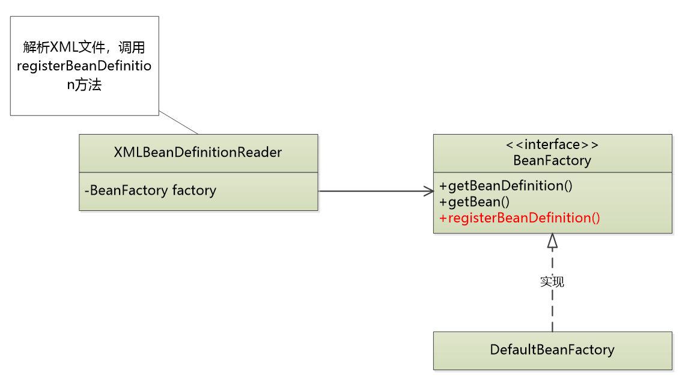
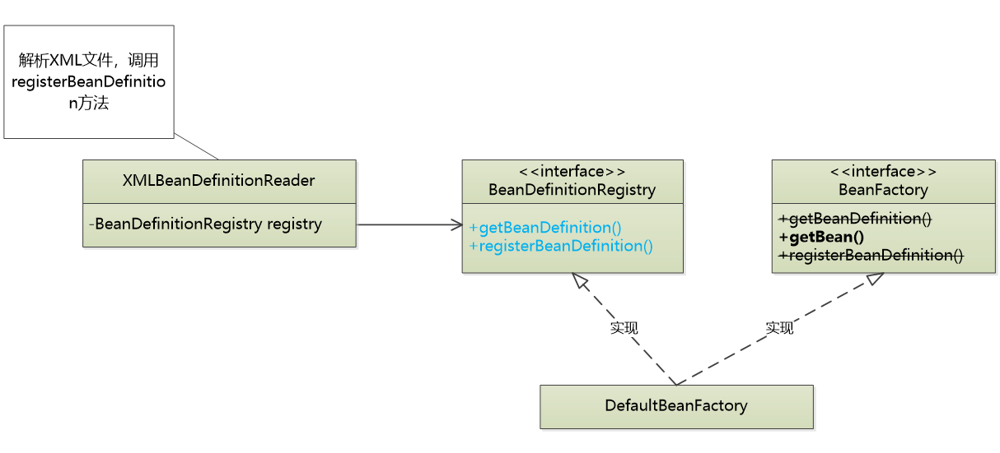
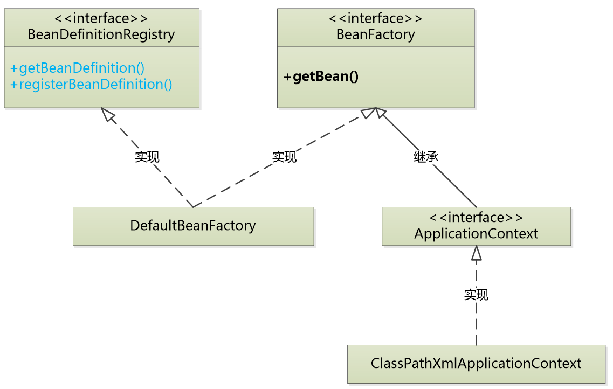
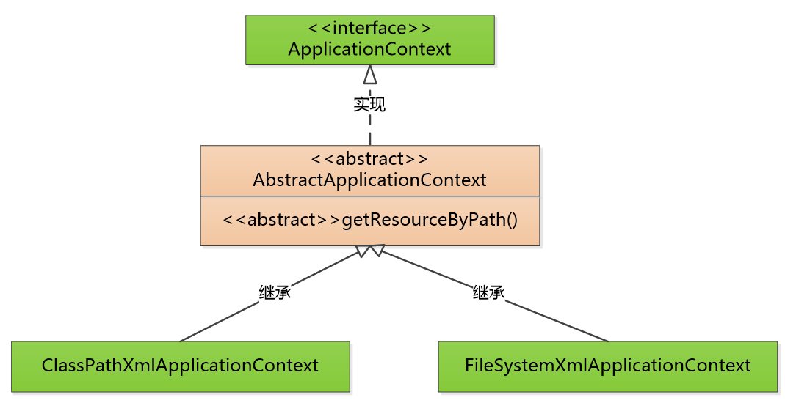

# Basic BeanFactory（下）   

### 方法迁移   

D：看一下这个类，``loadBeanDefinition()``方法有什么问题呢？  

```java
public class DefaultBeanFactory implements BeanFactory {
	
	public static final String ID_ATTRIBUTE = "id";
	public static final String CLASS_ATTRIBUTE = "class";
	private final Map<String,BeanDefinition> beanDefinitionMap = new ConcurrentHashMap();
	
	/**
	 * 构造文件
	 * @param configFile
	 */
	public DefaultBeanFactory(String configFile) {
		loadBeanDefinition(configFile);
	}
	/**
	 * 加载xml
	 * @param configFile
	 */
	private void loadBeanDefinition(String configFile) {
		InputStream is = null;
		try {
			ClassLoader cl = ClassUtils.getDefaultClassLoader();
			is = cl.getResourceAsStream(configFile); //读取配置文件
			SAXReader reader = new SAXReader();  //dom4j解析xml文件
			Document doc = reader.read(is);   //读取成Document文件
			
			Element root = doc.getRootElement();  //<beans>
			Iterator<Element> iter = root.elementIterator();
			while(iter.hasNext()){
				Element ele = (Element)iter.next();
				String id = ele.attributeValue(ID_ATTRIBUTE);
				String beanClassName = ele.attributeValue(CLASS_ATTRIBUTE);
				BeanDefinition bd = new GenericBeanDefinition(id,beanClassName);
				this.beanDefinitionMap.put(id,bd);
			}
		} catch (Exception e) {
			//e.printStackTrace();
			throw new BeanDefinitionStoreException("IOException parsing XML document", e);
		}finally {
			if(is != null){
				try {
					is.close();
				} catch (Exception e) {
					e.printStackTrace();
				}
			}
		}
	}

	public BeanDefinition getBeanDefinition(String beanID) {
		return this.beanDefinitionMap.get(beanID);
	}
	/**
	 * 获取bean对象
	 */
	public Object getBean(String beanID) {
		BeanDefinition bd = this.getBeanDefinition(beanID);  //获取BeanDefinition对象
		if(bd == null){
			throw new BeanCreationException("Error creating does not exist");
			//return null;
		}
		ClassLoader cl = ClassUtils.getDefaultClassLoader();
		String beanClassName = bd.getBeanClassName();
		try {
			Class<?> clz = cl.loadClass(beanClassName);
			return clz.newInstance();   //创建对象
		}
		catch (Exception e) {
			throw new BeanCreationException("Error creating does not exist");
		}
		/*catch (ClassNotFoundException e) {
			e.printStackTrace();
		}catch (InstantiationException e) {
			e.printStackTrace();
		}catch (IllegalAccessException e) {
			e.printStackTrace();
		}*/
		
	}

}
```

M：会有什么不妥的地方吗？

Z：``loadBeanDefinition()``做的是xml文件的读取，而``getBean()``做的是对象的获取。违背了SRP单一职责原则。

M：什么是单一职责原则？怎么理解？

Z：比如，一根尺子，既可以用来打学生手板，也可以用来丈量布匹。而在单一职责原理下，尺子的两个功能就是引起这个类变化的两个原因，就应该写成两个类。   

M：根据单一职责，loadBeanDefinition提取成XMLBeanDefinitionReader类，然后通过``registerBeanDefinition()``方法进行调用。

    

Z：但是这样子的类图还有缺点就是,``registerBeanDefinition()``方法是一个会对生成的对象进行影响的方法，太敏感了，不应该直接向客户暴露。可以的话，我们要尽量向客户暴露最少量接口。所以要做接口拆分：

  

把两个无关的方法提取到BeanDefinitionRefistry类中，DefaultBeanFactory再同时对两个接口进行实现。

M：简单来说，就是本来在BeanFactory中读取xml文件，然后存到数组中。现在变成在XmlBeanDefinitionReader中读取，而传入factory将会调用其自身存储方法，来存储查询到的数据。

Z：第一步，我们要做的是测试案例。由于之前已经有测试案例，所以在其上面进行修改：

```java
	@Test
	public void testGetBean() {
		//读取配置文件     面向接口编程
		DefaultBeanFactory factory = new DefaultBeanFactory();
		XmlBeanDefinitionReader reader = new XmlBeanDefinitionReader(factory);
		reader.loadBeanDefinitions("petstore-v1.xml");
		
//		BeanFactory factory = new DefaultBeanFactory("petstore-v1.xml");
		BeanDefinition bd = factory.getBeanDefinition("petStore");
		//校验配置文件属性
		assertEquals("org.litespring.service.v1.PetStoreService", bd.getBeanClassName());
		//实例化对象
		PetStoreService petStore = (PetStoreService)factory.getBean("petStore");
		//判断对象成功实例化否
		assertNotNull(petStore);
	}
```

M：``BeanFactory factory = new DefaultBeanFactory("petstore-v1.xml");``这个方法是怎么修改为以下代码的呢？

```java
		//读取配置文件     面向接口编程
		DefaultBeanFactory factory = new DefaultBeanFactory();
		XmlBeanDefinitionReader reader = new XmlBeanDefinitionReader(factory);
		reader.loadBeanDefinitions("petstore-v1.xml");
```

Z：因为DefaultBeanFactory类是最底层的类，实现它之后将对象传到上一层的类中

````java
		DefaultBeanFactory factory = new DefaultBeanFactory();
		XmlBeanDefinitionReader reader = new XmlBeanDefinitionReader(factory);
````

因为``loadBeanDefinitions()``方法在XmlBeanDefinitionReader类中，所以需要在该类实例化的对象中调用解析xml的方法``reader.loadBeanDefinitions("petstore-v1.xml");``      

D：``XmlBeanDefinitionReader reader = new XmlBeanDefinitionReader(factory);``将带有存储方法的对象传给XmlBeanDefinitionReader，它是怎么实现其方法的调用的呢？

Z：如下代码

```java
	public XmlBeanDefinitionReader(BeanDefinitionRegistry registry){
		this.registry = registry;
	}
	/**
	 * 加载xml(职责分离，挪到xml处理类中)
	 * @param configFile
	 */
	public void loadBeanDefinition(String configFile) {
		InputStream is = null;
		try {
			ClassLoader cl = ClassUtils.getDefaultClassLoader();
			is = cl.getResourceAsStream(configFile); //读取配置文件
			SAXReader reader = new SAXReader();  //dom4j解析xml文件
			Document doc = reader.read(is);   //读取成Document文件
			
			Element root = doc.getRootElement();  //<beans>
			Iterator<Element> iter = root.elementIterator();
			while(iter.hasNext()){
				Element ele = (Element)iter.next();
				String id = ele.attributeValue(ID_ATTRIBUTE);
				String beanClassName = ele.attributeValue(CLASS_ATTRIBUTE);
				BeanDefinition bd = new GenericBeanDefinition(id,beanClassName);
				this.registry.registerBeanDefinition(id, bd);
			}
		} catch (Exception e) {
			//e.printStackTrace();
			throw new BeanDefinitionStoreException("IOException parsing XML document", e);
		}finally {
			if(is != null){
				try {
					is.close();
				} catch (Exception e) {
					e.printStackTrace();
				}
			}
		}
	}
```

传过去的时候会调用其构造函数，获取实例化``BeanDefinitionRegistry``的对象，然后代码在执行的时候使用已经实例化了的``BeanDefinitionRegistry``的对象：``this.registry.registerBeanDefinition(id, bd);``  

D：为什么要把``getBeanDefinition()``和``registerBeanDefinition()``从一个接口提取到一个新的接口``BeanDefinitionRegistry``中？

Z：那我们要先了解接口的作用，当我们使用面向接口编程的时候，我们就只能使用该接口下的方法。

像``BeanFactory test = new DefaultBeanFactory();``我就只能使用BeanFactory 接口下声明的方法。因为``BeanFactory ``这个接口是可以让用户调用的，但是``getBeanDefinition()``和``registerBeanDefinition()``是用来处理内部数据用的，用户一般情况下根本就不需要对其干预。

为了不将这两个方法暴露给用户，我们单独将它两提取成一个接口``BeanDefinitionRegistry``，交由``DefaultBeanFactory``去共同实现:

```java
public class DefaultBeanFactory implements BeanFactory ,BeanDefinitionRegistry{
	
	public static final String ID_ATTRIBUTE = "id";
	public static final String CLASS_ATTRIBUTE = "class";
	private final Map<String,BeanDefinition> beanDefinitionMap = new ConcurrentHashMap();

	public BeanDefinition getBeanDefinition(String beanID) {
		return this.beanDefinitionMap.get(beanID);
	}
	public void registerBeanDefinition(String beanID, BeanDefinition bd) {
		this.beanDefinitionMap.put(beanID, bd);		
	}

	/**
	 * 获取bean对象
	 */
	public Object getBean(String beanID) {
		BeanDefinition bd = this.getBeanDefinition(beanID);  //获取BeanDefinition对象
		if(bd == null){
			throw new BeanCreationException("Error creating does not exist");
			//return null;
		}
		ClassLoader cl = ClassUtils.getDefaultClassLoader();
		String beanClassName = bd.getBeanClassName();
		try {
			Class<?> clz = cl.loadClass(beanClassName);
			return clz.newInstance();   //创建对象
		}
		catch (Exception e) {
			throw new BeanCreationException("Error creating does not exist");
		}
		/*catch (ClassNotFoundException e) {
			e.printStackTrace();
		}catch (InstantiationException e) {
			e.printStackTrace();
		}catch (IllegalAccessException e) {
			e.printStackTrace();
		}*/
	}

}
```

Z：因为测试用例也出现了重复配置性代码，可以提取到@Before下。Before会在每个方法执行前执行

```java
	DefaultBeanFactory factory = null;
	XmlBeanDefinitionReader reader = null;
	
	@Before
	public void setUP(){
		factory = new DefaultBeanFactory();
		reader = new XmlBeanDefinitionReader(factory);
	}
```

### 接口继承

D：为什么要在外层再被ApplicationContext继承？

     

Z：因为我们一般不用知道底层DefaultBeanFactory，XmlBeanDefinitionReader这些类的实现细节，而是将其内部的逻辑封装起来，只调用最少的请求。

M：创建测试用例，我们希望传一个xml文件进去，就能直接使用其getBean方法，两个类整合成一个类

```java
public class ApplicationContextTest {

	@Test
	public void testGetBean() {
		ApplicationContext ctx = new ClassPathXmlApplicationContext("petstore-v1.xml");
		PetStoreService petStore = (PetStoreService)ctx.getBean("petStore");
		Assert.assertNotNull(petStore);
	}

}
```

D：本来直接让ClassPathXmlApplicationContext去实现BeanFactory的``Object getBean(String string);``方法就可以，为什么要继承呢？

Z：loading

D：继承接口的实现类，我们要怎么去编写其底层方法呢？

Z：使用构造方法注入一个DefaultBeanFactory对象，然后曝光一个getBean()方法出来

```java
public class ClassPathXmlApplicationContext implements ApplicationContext {

	private DefaultBeanFactory factory = null;
	
	public ClassPathXmlApplicationContext(String configFile){
		factory = new DefaultBeanFactory();
		XmlBeanDefinitionReader reader = new XmlBeanDefinitionReader(factory);
		reader.loadBeanDefinition(configFile);
	}
	
	public Object getBean(String beanID) {
		return factory.getBean(beanID);
	}

}
```

M：用户直接通过ClassPathXmlApplicationContext就可以传配置Class文件路径，获取Bean对象了。

Z：因为多个Junit测试需要测试，可以使用Junit Suite套件将测试案例统一管理起来。    

### 文件流    

Z：用户直接通过ClassPathXmlApplicationContext就可以传配置Class文件路径，获取Bean对象。但是如果传的是File文件的路径，这个方法就不通用了。

D：用户调用ClassPathXmlApplicationContext类可以获取类的Bean对象，调用FileSystemXmlApplicationContext类可以获取File类的对象，单元测试要怎么写？

Z：如下：

```java
public class ApplicationContextTest {

	@Test
	public void testGetBean() {
		ApplicationContext ctx = new ClassPathXmlApplicationContext("petstore-v1.xml");
		PetStoreService petStore = (PetStoreService)ctx.getBean("petStore");
		Assert.assertNotNull(petStore);
	}
	
	@Test
	public void testGetBeanFromFileSystemContext() {
		ApplicationContext ctx = new FileSystemXmlApplicationContext("D:\\学习资料\\petstore-v1.xml");
		PetStoreService petStore = (PetStoreService)ctx.getBean("petStore");
		Assert.assertNotNull(petStore);
	}
}
```

D：现在工作流的获取方式如下：XmlBeanDefinitionReader.java

```java
			ClassLoader cl = ClassUtils.getDefaultClassLoader();  //获取classLoader
			is = cl.getResourceAsStream(configFile); //读取配置文件
```

但是这种方式获取不了File文件，导致这个XmlBeanDefinitionReader文件不能通用，如何处理？

Z：把路径的文件经行处理后再传到XmlBeanDefinitionReader中

因为处理Class和File的方法相似，可以把接口提取出来：Resource.java

```java
public interface Resource {
	public InputStream getInputStream() throws IOException;
	public String getDescription();

}
```

两种解析方式分别实现Resource接口，提供获取文件流方法：

Class解析：

```java
public class ClassPathResource implements Resource {
	
	private String path;
	private ClassLoader classLoader;

	public ClassPathResource(String path){  //构造方法1
		this(path, (ClassLoader)null);
	}
	
	
	public ClassPathResource(String path, ClassLoader classLoader) {   //构造方法2
		this.path = path;
		this.classLoader = (classLoader != null ? classLoader : ClassUtils.getDefaultClassLoader());
	}
	
	public InputStream getInputStream() throws IOException {  //获取流方法
		InputStream is = this.classLoader.getResourceAsStream(this.path);
		if(is == null){
			throw new FileNotFoundException(path + "cannot be opened");
		}
		return is;
	}

	public String getDescription() {
		return this.path;
	}

}
```

File解析：

```java
public class FileSystemResource implements Resource {

	private final String path;
	private final File file;
	
	public FileSystemResource(String path){
		Assert.notNull(path, "Path must not be null");
		this.file = new File(path);    //根据路径new File
		this.path = path;
	}
	
	public InputStream getInputStream() throws IOException {
		return new FileInputStream(this.file);   //将File转化为数据流
	}

	public String getDescription() {
		return "file [" + this.file.getAbsolutePath() + "]";
	}

}
```

提取出解析代码之后，XmlBeanDefinitionReader只要调用``is = resource.getInputStream();``就可以获取两种文件流，实现了通用。  

M：``Assert.notNull(path, "Path must not be null");``是怎么实现自定义异常的？

Z：对原有的异常进行封装，形成工具类

```java
public class Assert {
	public static void notNull(Object object, String message){
		if(object == null){
			throw new IllegalArgumentException(message);
		}
	}

}
```

M：简单来说，就是因为要解析Class和File两种形式，但是负责解析的类的方法只对Class进行解析，于是我们将文件先解析完再传进类的方法中。因为解析有共性，所以提出出一个接口，再用两个类分别实现改接口。

### 模板方法    

D：以下两个方法的相似度很高，要怎么把相似的代码提取出来呢?

```java
	public ClassPathXmlApplicationContext(String configFile){
		factory = new DefaultBeanFactory();
		XmlBeanDefinitionReader reader = new XmlBeanDefinitionReader(factory);
		Resource resource = new ClassPathResource(configFile);
		reader.loadBeanDefinition(resource);
	}
```

```java
	public FileSystemXmlApplicationContext(String configFile){
		factory = new DefaultBeanFactory();
		XmlBeanDefinitionReader reader = new XmlBeanDefinitionReader(factory);
		Resource resource = new FileSystemResource(configFile);
		reader.loadBeanDefinition(resource);
	}
```

仅仅是实例化对象的方法不同：   

``Resource resource = new ClassPathResource(configFile);``和``Resource resource = new FileSystemResource(configFile);``   

Z：使用模板方法设计模式：

   

```java  
public abstract class AbstrackApplicationContext implements ApplicationContext {
	
	private DefaultBeanFactory factory = null;
	
	public AbstrackApplicationContext(String configFile){   //相同代码
		factory = new DefaultBeanFactory();
		XmlBeanDefinitionReader reader = new XmlBeanDefinitionReader(factory);
		Resource resource = this.getResourceByPath(configFile);
		reader.loadBeanDefinition(resource);
	}
	
	public Object getBean(String beanID) {
		return factory.getBean(beanID);
	}
	
	protected abstract Resource getResourceByPath(String path);    //有差异的抽象方法
}
```

将相同的方法提取出来，形成抽象类，作为模板使用。而不同的代码部分定义抽象方法进行实现：

```java
public class ClassPathXmlApplicationContext extends AbstrackApplicationContext {

	public ClassPathXmlApplicationContext(String configFile) {
		super(configFile);
	}

	@Override
	protected Resource getResourceByPath(String configFile) {
		return new ClassPathResource(configFile);
	}

}
```

```java
public class FileSystemXmlApplicationContext extends AbstrackApplicationContext{

	public FileSystemXmlApplicationContext(String configFile) {
		super(configFile);
	}

	@Override
	protected Resource getResourceByPath(String configFile) {
		return new FileSystemResource(configFile);
	}

}
```

### ClassLoader

视频3 的 42:54


