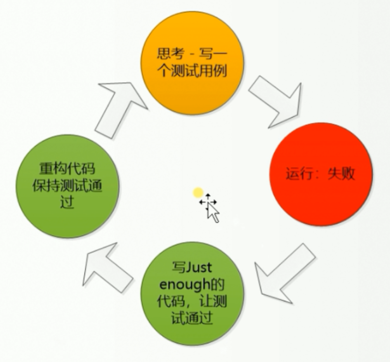

# TDD的Demo   

M：什么是TDD？

Z：TDD是**测试驱动开发**（Test-Driven Development）的英文简称，是敏捷开发中的一项核心实践和技术，也是一种设计方法论。TDD的原理是在开发功能代码之前，先编写单元测试用例代码，测试代码确定需要编写什么产品代码。    

M：那具体要怎么做呢？

Z： 如下   



M：能写一个Demo么？

Z：TDD开发Demo：测试会返回所有素数数组的方法（边界版）   

1. 测试案例可能有哪些：边界数据 , 正常数据   

   边界数据：0,-1,2

   正常数据：9,17,30

   创建测试用例：测试边界条件

   ```java
   	@Test
   	public void testGetPrimesForEmptyResult() {
   		int[] expected = {};
   		
   		Assert.assertArrayEquals(expected, PrimeUtil.getPrimes(2));
   		Assert.assertArrayEquals(expected, PrimeUtil.getPrimes(0));
   		Assert.assertArrayEquals(expected, PrimeUtil.getPrimes(-1));
   	}
   ```

2. 运行失败尝试：写一个有问题的测试对象，保证案例具有判断能力

   ```java
   public class PrimeUtil {
   	public static int[] getPrimes(int i){
   		
   		return null;
   	}
   }
   ```

3. 编写功能代码，通过测试案例

   ```java
   	public static int[] getPrimes(int max){
   		if(max <= 2){
   			return new int[]{};
   		}
   		return null;
   	}
   ```

4. 重构，这里代码很简洁，无需再进行重构。

Z：TDD开发Demo：测试会返回所有素数数组的方法（正常版）   

1. 编写测试案例：

   ```java
   	@Test
   	public void testGetPrimes(){
   		
   		Assert.assertArrayEquals(new int[]{2,3,5,7}, PrimeUtil.getPrimes(9));
   		Assert.assertArrayEquals(new int[]{2,3,5,7,11,13}, PrimeUtil.getPrimes(17));
   		Assert.assertArrayEquals(new int[]{2,3,5,7,11,13,17,19,23,29}, PrimeUtil.getPrimes(30));
   	}
   ```

2. 运行失败尝试，没有代码，返回失败

3. 编写功能代码，通过测试案例

   ```java
   	public static int[] getPrimes(int max){
   		if(max <= 2){
   			return new int[]{};
   		}else{
   			int[] newArray = new int[max];
   			int size = 0;
   			int j = 0;
   			for(int i=2 ; i < max ; i++){
   				for (j = 2; j < i/2+1; j++) {
   					if(i % j == 0){
   						break;
   					}
   				}
   				if(j == i/2+1){
   					newArray[size++] = i;
   				}
   			}
   			newArray = Arrays.copyOf(newArray, size);
   			return newArray;
   		}
   	}
   ```

4. 重构，虽然这段代码通过了测试案例，但是其编写很复杂，可以重构如下：

   - 重命名(无需测试)

   ```java
   	public static int[] getPrimes(int max){
   		if(max <= 2){
   			return new int[]{};
   		}else{
   			int[] primes = new int[max];
   			int count = 0;
   			int j = 0;
   			for(int num=2 ; num < max ; num++){
   				for (j = 2; j < num/2+1; j++) {
   					if(num % j == 0){
   						break;
   					}
   				}
   				if(j == num/2+1){
   					primes[count++] = num;
   				}
   			}
   			primes = Arrays.copyOf(primes, count);
   			return primes;
   		}
   	}
   ```

   - 提取函数(测试)

   ```java
   	public static int[] getPrimes(int max){
   		if(max <= 2){
   			return new int[]{};
   		}else{
   			int[] primes = new int[max];
   			int count = 0;
   			for(int num=2 ; num < max ; num++){
   				if(isPrime(num)){
   					primes[count++] = num;
   				}
   			}
   			primes = Arrays.copyOf(primes, count);
   			return primes;
   		}
   	}

   	private static boolean isPrime(int num) {
   		for (int j = 2; j < num/2+1; j++) {
   			if(num % j == 0){
   				return false;
   			}
   		}
   		return true;
   	}
   ```

   - 分支进行调整(测试)

   ```java
   	public static int[] getPrimes(int max){
   		if(max <= 2){
   			return new int[]{};
   		}
   		int[] primes = new int[max];
   		int count = 0;
   		for(int num=2 ; num < max ; num++){
   			if(isPrime(num)){
   				primes[count++] = num;
   			}
   		}
   		primes = Arrays.copyOf(primes, count);
   		return primes;
   	}

   	private static boolean isPrime(int num) {
   		for (int i = 2; i < num/2+1; i++) {
   			if(num % i == 0){
   				return false;
   			}
   		}
   		return true;
   	}
   ```

M：到这里，边界条件和正常输入的测试用例就都通过了。总结一下，TDD开发方式：

1. 分析，编写不同方面的测试用例
2. 每个测试用例之前先确保Junit具有报错能力，做个错误的返回测试
3. 编写实现代码
4. 对代码进行重构：先重构名称，提取方法，修改结构